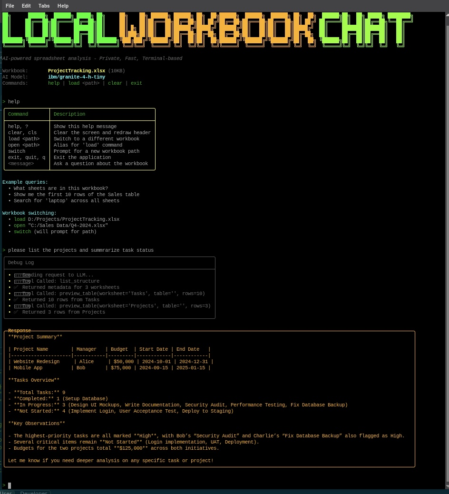

# Exploring Ideas Through Code: One Experiment at a Time

## About These Projects

All of my projects exist for one main reason: **learning through experimentation**.  
Each repository is a result of me asking questions like:  
> “Is this possible?”  
> “I wonder if…?”  

Sometimes they’re attempts to solve real problems I’ve come across, other times they’re just me following curiosity down a rabbit hole.  
This is my **learning playground**, a space where I test ideas, try new things, and learn by doing.  

I share them here in case they help or inspire someone else.  
So expect some projects to be **messy**, others **well-structured** — all of them are honest reflections of learning in progress.  

Feel free to **use**, **modify**, or **build on** anything here. 

So here we go:

# Excel Local MCP

Local Model Context Protocol server and CLI tools for conversational analysis of Excel workbooks. Chat with your spreadsheets using natural language - ask questions, search data, preview tables, and switch between workbooks without leaving the terminal or browser.

**🚀 Current Status:** Work in progress. CLI tools are stable and tested. Web UI is functional but needs validation testing. Both share the same robust backend (MCP + Semantic Kernel).

## Screenshots

### CLI Agent



### Web Chat UI

> 📸 Screenshot coming soon
> 
> *The web UI features a clean Blazor interface with:*
> - *File upload for workbooks*
> - *Chat-style conversation interface*
> - *Proper HTML table rendering*
> - *Suggested queries in sidebar*
> - *Conversation history*

## Features

✅ **Semantic Kernel CLI Agent** - Beautiful terminal UI powered by [Spectre.Console](https://spectreconsole.net/)  
✅ **Debug Logging** - See exactly which tools the LLM calls and when  
✅ **Workbook Switching** - Load different workbooks without restarting  
✅ **MCP Server** - Standards-compliant Model Context Protocol server  
✅ **Sample Workbooks** - Realistic test data (projects, employees, budgets)  
✅ **Local-First** - Everything runs on your machine, data never leaves  
✅ **Cross-Platform** - Windows, Linux, macOS via .NET 9  

> **Quick Start:** Jump to [Getting Started](#getting-started) to run in 3 minutes.

---

## Why This Exists

- **Keep spreadsheets private.** Many teams cannot upload financial or regulated Excel files to hosted services. Running the MCP server locally lets agents analyze data without leaving the device.
- **Bring Excel into the MCP ecosystem.** Most existing MCP tools focus on text documents or REST APIs. This project fills the gap by translating workbook structure into MCP tools/resources that any compliant client can consume.
- **Enable agent automation.** With a consistent schema for worksheets, tables, and rows, agents can answer natural language questions, generate summaries, and trigger downstream workflows that depend on spreadsheet context.

## Use Cases

- “What tabs and tables exist in the budget workbook, and who owns each one?”
- “Find every row across worksheets that references supplier X with an overdue balance.”
- “Preview the first 20 rows of the quarterly awards table and send it to a teammate.”
- “Combine this with a local CRM MCP server so the agent can reconcile spreadsheet exports with live system data.”

## Future Enhancements

See the evolving roadmap in [docs/FutureFeatures.md](docs/FutureFeatures.md). Highlights on deck:

- Support filtered range previews (e.g., formulas vs. values, pivot expansions).
- Implement write-back tools to update cells, add worksheets, or annotate findings.
- Expose analytics such as value distributions, outlier detection, or chart generation.
- Add WebSocket/HTTP transports so the server can run behind a relay or container orchestration platform.

## Components

### Core Backend (Stable)
- **`src/ExcelMcp.Server`** – Stdio JSON-RPC MCP server that indexes a workbook
- **`src/ExcelMcp.Contracts`** – Shared data contracts
- **`src/ExcelMcp.Client`** – Command-line MCP client tool

### User Interfaces (Work in Progress)

#### CLI Agent (Recommended - Well Tested ✅)
- **`src/ExcelMcp.SkAgent`** – Semantic Kernel CLI agent with AS/400-style terminal interface
  - ✅ Debug logging shows tool calls
  - ✅ Workbook switching without restart
  - ✅ Colorized output
  - ✅ Works with any workbook (no assumptions)
  - ✅ Tested on Windows, Linux (Raspberry Pi)

#### Web Chat (Functional - Needs Validation ⚠️)
- **`src/ExcelMcp.ChatWeb`** – ASP.NET Blazor Server web UI
  - ✅ Browser-based chat interface
  - ✅ File upload for workbooks
  - ✅ HTML table rendering
  - ✅ Workbook-agnostic prompts
  - ✅ Builds on Linux ARM64
  - ⏳ Needs manual validation testing (see [WEB-CHAT-ROADMAP.md](WEB-CHAT-ROADMAP.md))

### Documentation
- **`docs/UserGuide.md`** – Extended walkthrough covering setup, workflows, and troubleshooting
- **`docs/FutureFeatures.md`** – Roadmap and future enhancements
- **`docs/SkAgentQuickStart.md`** – Quick start guide for the CLI agent
- **`docs/WebChatImprovements.md`** – Technical details on web chat
- **`test-data/README.md`** – Sample workbooks and testing guide
- **`GETTING-BACK-ON-TRACK.md`** – Development status and next steps

## Prerequisites

- .NET SDK 9.0+
- PowerShell 7+ (Windows/macOS/Linux) for the packaging scripts
- Local `.xlsx` workbook to analyze

## Build & Test

```pwsh
dotnet build
dotnet test
```

## Quick Starts

### Semantic Kernel CLI Agent (Recommended)

The SK agent provides a classic AS/400-style terminal interface with conversational AI, debug logging, and workbook switching:

```pwsh
# 1. Start your local LLM server (e.g., LM Studio on port 1234)

# 2. Create sample workbooks (optional)
pwsh -File scripts/create-sample-workbooks.ps1

# 3. Run the agent
dotnet run --project src/ExcelMcp.SkAgent -- --workbook "test-data/ProjectTracking.xlsx"

# 4. Chat with your workbook:
> what tables exist in this workbook?
> show me all high priority tasks
> load test-data/EmployeeDirectory.xlsx
> who works in Engineering?
> exit
```

**Features:**
- ✅ Green colorized terminal UI
- ✅ Debug logging shows tool calls
- ✅ Switch workbooks without restarting (`load`, `open`, `switch` commands)
- ✅ Case-insensitive search
- ✅ Works with local LLMs (LM Studio, Ollama) or OpenAI

**See:** [docs/SkAgentQuickStart.md](docs/SkAgentQuickStart.md) for detailed guide.

### Web Chat (For Testing - Linux/Raspberry Pi Supported)

The web chat provides a browser-based interface. Currently functional but needs validation testing.

```bash
# Linux/Raspberry Pi (Recommended)
./run-chatweb.sh
# Opens on http://localhost:5001

# Windows (Development)
dotnet run --project src/ExcelMcp.ChatWeb
# Opens on http://localhost:5000
```

**What Works:**
- ✅ Browser-based chat interface
- ✅ File upload for workbooks  
- ✅ HTML table rendering (fixed Nov 1)
- ✅ Workbook-agnostic prompts (learned from CLI)
- ✅ Conversation history
- ✅ Runs on Raspberry Pi OS (ARM64)

**What Needs Testing:**
- ⏳ Manual validation (load, query, verify results)
- ⏳ Error handling scenarios
- ⏳ Performance benchmarking
- ⏳ Cross-browser compatibility

**See:** 
- [WEB-CHAT-ROADMAP.md](WEB-CHAT-ROADMAP.md) - Testing checklist & roadmap
- [GETTING-BACK-ON-TRACK.md](GETTING-BACK-ON-TRACK.md) - Current status & next steps
- [docs/WebChatImprovements.md](docs/WebChatImprovements.md) - Technical details

### MCP Server and CLI Client

For direct MCP protocol interaction or programmatic access:

```pwsh
# Use the CLI client (prompts for workbook path on first run)
dotnet run --project src/ExcelMcp.Client -- list
dotnet run --project src/ExcelMcp.Client -- search "product name"
dotnet run --project src/ExcelMcp.Client -- preview Sales --rows 10
```

### Running the MCP Server Directly

For integration with other MCP-compatible clients:

```pwsh
# Run the stdio MCP server directly
dotnet run --project src/ExcelMcp.Server -- --workbook "D:/Data/sample.xlsx"
```

## Example mcp,json for VS Code

```
{
  "servers": {
    "excel-workbook-mcp": {
      "type": "stdio",
      "command": "${workspaceFolder}/src/ExcelMcp.Server/bin/Debug/net9.0/ExcelMcp.Server.exe",
      "args": [
        "--workbook",
        "${input:excel-workbook-path}"
      ]
    }
  },
  "inputs": [
    {
      "id": "excel-workbook-path",
      "type": "promptString",
      "description": "Full path to the Excel workbook to load",
      "default": "D:/Downloads/sampledata.xlsx"
    }
  ]
}
```

## Packaging

Package each component as a self-contained, single-file executable:

```pwsh
pwsh -File scripts/package-server.ps1   # MCP Server
pwsh -File scripts/package-client.ps1   # CLI Client
pwsh -File scripts/package-skagent.ps1  # CLI Agent (Recommended - Well Tested ✅)
pwsh -File scripts/package-chatweb.ps1  # Web Chat (Functional - Needs Testing ⚠️)
```

Each script publishes to `dist/<rid>/<AppName>` with platform-specific launch helpers (`.ps1`, `.sh`, `.bat`).

**Recommended for users:** Start with `package-skagent.ps1` (CLI agent) as it's been thoroughly tested.

**For developers:** The web chat works on Linux/Raspberry Pi but needs validation testing before broad use. See [WEB-CHAT-ROADMAP.md](WEB-CHAT-ROADMAP.md) for testing checklist.

Pass `-Runtime` (e.g., `linux-x64`, `linux-arm64`) or `-SkipZip` as needed.

## Integrate with Agents

Point your MCP-capable agent at the packaged server or use the CLI/web app launchers to negotiate workbook/server paths. All tools (`excel-list-structure`, `excel-search`, `excel-preview-table`) and resources (`excel://` URIs) follow the MCP spec, so they work with OpenAI agents, MCP bridges, or any compatible orchestrator.

---

## Acknowledgments

**Built with these amazing open-source projects:**

- **[Spectre.Console](https://spectreconsole.net/)** - Beautiful, colorful CLI interfaces with rich formatting
- **[Semantic Kernel](https://github.com/microsoft/semantic-kernel)** - Microsoft's LLM orchestration framework
- **[ClosedXML](https://github.com/ClosedXML/ClosedXML)** - Excel file manipulation without Office dependencies
- **[Model Context Protocol](https://modelcontextprotocol.io/)** - Anthropic's standard for AI-to-tool communication

Special thanks to the Spectre.Console team for making terminal apps beautiful! 🎨

---

## Getting Started

### 1. Build the Project
```pwsh
dotnet build
dotnet test
```

### 2. Create Sample Workbooks
```pwsh
pwsh -File scripts/create-sample-workbooks.ps1
```

This creates three test workbooks in `test-data/`:
- **ProjectTracking.xlsx** - Tasks, projects, time logs
- **EmployeeDirectory.xlsx** - Employee and department data
- **BudgetTracker.xlsx** - Income and expense tracking

See [test-data/README.md](test-data/README.md) for details and example queries.

### 3. Run the Semantic Kernel Agent
```pwsh
# With a local LLM (recommended: LM Studio, Ollama)
dotnet run --project src/ExcelMcp.SkAgent -- --workbook test-data/ProjectTracking.xlsx

# Or set environment variables
$env:LLM_BASE_URL = "http://localhost:1234/v1"
$env:LLM_MODEL_ID = "local-model"
$env:EXCEL_MCP_WORKBOOK = "test-data/ProjectTracking.xlsx"
dotnet run --project src/ExcelMcp.SkAgent
```

### 4. Try It Out
```
> what tasks are high priority?
> show me all employees in Engineering
> load test-data/BudgetTracker.xlsx
> what's the total income?
> help
```

**Key Features to Explore:**
- 🔧 **Debug logging** - See exactly which tools the LLM calls
- 🔄 **Workbook switching** - Use `load`, `open`, or `switch` commands
- 🎨 **Colorized output** - Green banner, color-coded messages
- 📊 **Sample workbooks** - Realistic test data included

## Documentation

- **[User Guide](docs/UserGuide.md)** - Complete setup and workflow guide
- **[SK Agent Quick Start](docs/SkAgentQuickStart.md)** - CLI agent tutorial
- **[Debug Logging](docs/SkAgentDebugLog.md)** - Understanding tool calls
- **[Sample Workbooks](test-data/README.md)** - Test data reference
- **[Future Features](docs/FutureFeatures.md)** - Planned enhancements

## Troubleshooting

Common issues and solutions:

**LLM not calling tools / making up data:**
- See [docs/SkAgentTroubleshooting.md](docs/SkAgentTroubleshooting.md)
- Try better models: `gpt-4`, `phi-4`, `llama-3.1-8b-instruct`
- Check debug log: `⚠️ No tools were called` means model issue

**Search returning no results:**
- Fixed! Empty string bug resolved
- Search is case-insensitive by default
- Debug log shows: `caseSensitive=False`

**Wrong calculations:**
- Model limitation - local models may struggle with math
- Debug log shows tool calls but incorrect computation
- Use GPT-4 for accurate calculations

Refer to [docs/UserGuide.md](docs/UserGuide.md) for detailed workflow examples, environment variables, and troubleshooting notes.

## Acknowledgements

This project relies on the excellent ClosedXML library (https://github.com/ClosedXML/ClosedXML) as its core engine for reading and writing Excel workbooks (.xlsx files).
ClosedXML provides a clean, intuitive API built on top of the OpenXML SDK, allowing this MCP server to interact with Excel data without requiring Microsoft Excel or any COM automation.

Every workbook operation exposed through this MCP server, such as reading rows, writing cell values, or adding data, is powered internally by ClosedXML.

A huge thank you to the ClosedXML maintainers and contributors for their ongoing work on one of the most reliable and developer-friendly Excel libraries in the .NET ecosystem.
Your project makes it possible for tools like this to exist and run cross-platform in lightweight environments
