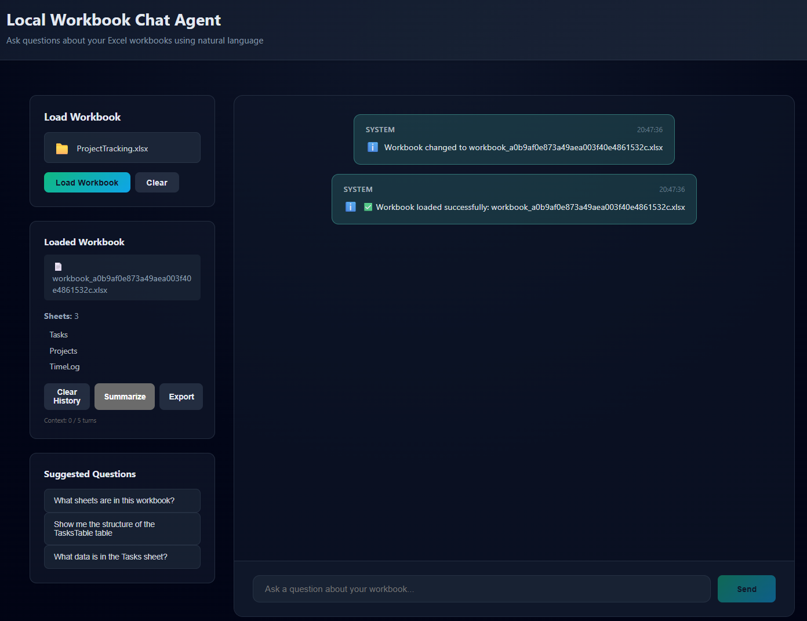
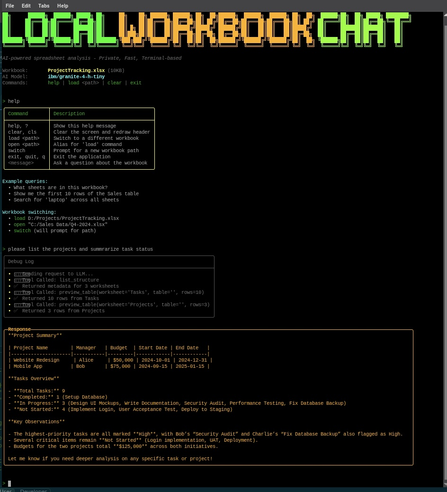

# Excel Local MCP

[](https://dotnet.microsoft.com/download/dotnet/10.0)
[](https://www.nuget.org/packages/ModelContextProtocol)
[](LICENSE)

A local-first [Model Context Protocol](https://modelcontextprotocol.io/) server that lets AI agents analyze and write to Excel workbooks — without the data ever leaving your machine. Ask questions in natural language, search across sheets, run pivot analysis, and update cells via any MCP-compatible client or the included web UI.

[Overview](#overview) · [Features](#features) · [Getting Started](#getting-started) · [MCP Tools](#mcp-tools) · [External Clients](#using-with-external-mcp-clients) · [Configuration](#configuration) · [Architecture](#architecture)

---

<div align="center">
  
</div>

---

## Overview

Many teams cannot upload financial, HR, or regulated Excel files to cloud services. **Excel Local MCP** solves this by running an MCP server entirely on your machine — the LLM reasons over your data without it ever touching an external API.

The server exposes 7 standard MCP tools that map directly to Excel operations. Any MCP-compatible client (Claude Desktop, GitHub Copilot, Cursor, your own code) can call these tools, or you can use the included Blazor web UI or terminal agent.

```
┌──────────────────────────────────────────────┐
│  Web UI       Terminal Agent    External MCP  │
│ (Blazor)    (Spectre.Console)  (Claude/etc.)  │
└─────────────────────┬────────────────────────┘
                      │  JSON-RPC over stdio
                      ▼
              ExcelMcp.Server
              (ModelContextProtocol SDK)
                      │
                 ClosedXML
                      │
             Excel workbook (.xlsx)
```

## Features

- **Privacy-first** — workbook data never leaves your machine; the LLM runs locally via Ollama or LM Studio
- **Standards-compliant MCP server** — built on `ModelContextProtocol` v1.1.0 SDK, compatible with any MCP client
- **7 Excel tools** — list structure, search, preview, pivot analysis, write cell, write range, create worksheet
- **Write-back with auto-backup** — every mutation creates a timestamped `.xlsx` backup before saving
- **Blazor web chat** — multi-turn conversation, suggested queries, session export to CSV/Markdown
- **Terminal agent** — AS/400-inspired REPL powered by Spectre.Console and Semantic Kernel
- **CLI debug tool** — inspect raw MCP tool calls for scripting and troubleshooting
- **Cross-platform** — Windows, Linux, macOS via .NET 10

## Getting Started

### Prerequisites

| Requirement | Version | Notes |
|---|---|---|
| [.NET SDK](https://dotnet.microsoft.com/download/dotnet/10.0) | 10.0+ | Required to build and run |
| Local LLM server | — | [Ollama](https://ollama.com/) (recommended) or [LM Studio](https://lmstudio.ai/) |
| Excel workbook | `.xlsx` / `.xls` | Your own file, or generate sample data (see below) |

> [!TIP]
> On Linux, install `libgdiplus` for full ClosedXML support: `sudo apt install libgdiplus`

### 1. Clone and build

```bash
git clone https://github.com/McFuzzySquirrel/local-workbook-mcp.git
cd local-workbook-mcp
dotnet build
```

### 2. Generate sample workbooks (optional)

```powershell
# Creates ProjectTracking.xlsx, EmployeeDirectory.xlsx, BudgetTracker.xlsx in test-data/
pwsh scripts/create-sample-workbooks.ps1

# Creates SalesWithPivot.xlsx (includes a pivot table)
pwsh scripts/create-pivot-test-workbook.ps1
```

### 3. Start your local LLM

**Ollama (recommended):**
```bash
ollama pull llama3.2
ollama serve
# Runs on http://localhost:11434 — auto-detected by the web UI and run-chatweb.sh
```

> **LM Studio alternative:** load any model and start the local server on `http://localhost:1234`. The web UI will auto-detect it, but `run-chatweb.sh` only checks the Ollama endpoint — you'll see a warning you can safely ignore.

### 4. Launch the web UI

```bash
# Linux / macOS
./run-chatweb.sh

# Windows / any platform
dotnet run --project src/ExcelMcp.ChatWeb
```

Open `http://localhost:5000`, select your workbook in the sidebar, and start chatting.

### 5. Or launch the terminal agent

```bash
dotnet run --project src/ExcelMcp.SkAgent -- --workbook "path/to/your/workbook.xlsx"
```

Example queries once the agent is running:

```
> What worksheets are in this workbook?
> Show me the first 10 rows of the Tasks sheet
> Search for 'Alice' across all sheets
> What does the SalesPivot pivot table contain?
> Update cell B2 in the Projects sheet to "Completed"
```



---

## MCP Tools

The server exposes the following tools to any MCP client. All tools accept an optional `workbook_path` parameter; when omitted, the server falls back to the `EXCEL_MCP_WORKBOOK` environment variable.

| Tool | Description |
|---|---|
| `excel-list-structure` | Summarize worksheets, named tables, column headers, row counts, and pivot tables. Call this first. |
| `excel-search` | Search rows whose cells match a text query. Supports sheet, table, limit, and case-sensitivity filters. |
| `excel-preview-table` | Return a CSV preview of a worksheet or named table (default 10 rows). |
| `excel-analyze-pivot` | Analyze pivot table structure: row, column, data, and filter fields plus aggregated data rows. |
| `excel-write-cell` | Write a value to a single cell. Auto-creates a timestamped backup before saving. |
| `excel-write-range` | Write multiple cells in one save operation. Auto-creates a timestamped backup. |
| `excel-create-worksheet` | Add a new blank worksheet. Auto-creates a timestamped backup. |

---

## Using with External MCP Clients

Because the server speaks standard MCP over stdio, any compatible client can use it directly.

### Claude Desktop

Add to your Claude Desktop config file:
- macOS: `~/Library/Application Support/Claude/claude_desktop_config.json`
- Windows: `%APPDATA%/Claude/claude_desktop_config.json`

```json
{
  "mcpServers": {
    "excel": {
      "command": "/path/to/ExcelMcp.Server",
      "args": ["--workbook", "/path/to/your/workbook.xlsx"]
    }
  }
}
```

A ready-to-merge snippet is in [mcp-config/claude_desktop_config.json](mcp-config/claude_desktop_config.json).

### Cursor

Merge into `~/.cursor/mcp.json` — see [mcp-config/cursor_mcp_config.json](mcp-config/cursor_mcp_config.json).

### GitHub Copilot / VS Code Agent Mode

Create `.vscode/mcp.json` in your workspace pointing at the server executable.

> [!NOTE]
> The server binary is built to `src/ExcelMcp.Server/bin/Debug/net10.0/ExcelMcp.Server` (or `.exe` on Windows). Use the `scripts/package-server.ps1` script to produce a self-contained distributable.

---

## Command-Line Client

`ExcelMcp.Client` is a lightweight CLI for directly invoking MCP tools. Useful for scripting, smoke testing, and debugging tool payloads.

```bash
export EXCEL_MCP_SERVER="src/ExcelMcp.Server/bin/Debug/net10.0/ExcelMcp.Server"
export EXCEL_MCP_WORKBOOK="test-data/ProjectTracking.xlsx"

# Available commands
dotnet run --project src/ExcelMcp.Client -- list
dotnet run --project src/ExcelMcp.Client -- preview Tasks --rows 5
dotnet run --project src/ExcelMcp.Client -- search "High priority"
dotnet run --project src/ExcelMcp.Client -- analyze-pivot SalesPivot
dotnet run --project src/ExcelMcp.Client -- write-cell --sheet Tasks --cell G1 --value "Done"
dotnet run --project src/ExcelMcp.Client -- write-range --sheet Tasks --range A10:B10 \
  --data '[{"cellAddress":"A10","value":"New Task"},{"cellAddress":"B10","value":"Open"}]'
dotnet run --project src/ExcelMcp.Client -- create-worksheet "Summary"
```

An automated smoke-test script covering all 4 sample workbooks is in [scripts/tests/manual-test-cli.sh](scripts/tests/manual-test-cli.sh) (35/35 passing).

---

## Configuration

### Web UI

Key settings in `src/ExcelMcp.ChatWeb/appsettings.json`:

```json
{
  "SemanticKernel": {
    "BaseUrl": "http://localhost:11434/v1",
    "Model": "llama3.2",
    "ApiKey": "not-needed-for-local",
    "TimeoutSeconds": 480
  },
  "ExcelMcp": {
    "ServerPath": "src/ExcelMcp.Server/bin/Debug/net10.0/ExcelMcp.Server"
  },
  "Conversation": {
    "MaxContextTurns": 5,
    "MaxResponseLength": 10000
  }
}
```

The `BaseUrl` auto-detects: Ollama (`localhost:11434`) is tried first, then LM Studio (`localhost:1234`).

Override for development in `appsettings.Development.json`.

### Terminal Agent

Configure via environment variables:

```bash
# Ollama (default — auto-detected)
export LLM_BASE_URL="http://localhost:11434/v1"
export LLM_MODEL_ID="llama3.2"
# or LM Studio
export LLM_BASE_URL="http://localhost:1234/v1"
export LLM_MODEL_ID="local-model"
export EXCEL_MCP_WORKBOOK="/path/to/workbook.xlsx"
```

---

## Testing

**57 user acceptance tests** covering all 4 sample workbooks and write operations:

```bash
dotnet test tests/ExcelMcp.UAT/ExcelMcp.UAT.csproj
```

**Manual test checklist** for the web UI (43 steps): [scripts/tests/manual-test-chatweb.md](scripts/tests/manual-test-chatweb.md)

**Automated CLI smoke tests** (35 automated + 2 manual-verify skips):

```bash
./scripts/tests/manual-test-cli.sh
# Filter to a single workbook group:
./scripts/tests/manual-test-cli.sh --workbook ProjectTracking
```

---

## Architecture

The system follows a **hexagonal / ports-and-adapters** pattern adapted for MCP. The server is an isolated process; UI and agent layers communicate with it exclusively via the MCP protocol.

```
src/
├── ExcelMcp.Server/       # MCP server — 7 tool handlers, ClosedXML backend
├── ExcelMcp.Contracts/    # Shared sealed-record DTOs
├── ExcelMcp.ChatWeb/      # Blazor Server web UI + Semantic Kernel orchestration
├── ExcelMcp.SkAgent/      # Terminal REPL agent (Spectre.Console + SK)
└── ExcelMcp.Client/       # CLI debug and scripting client
```

See [docs/Architecture.md](docs/Architecture.md) for full sequence diagrams and component descriptions.

> [!NOTE]
> UI layers never import `ExcelMcp.Server` directly. All data flows through JSON-RPC tool calls, which means the same server binary works identically for the web UI, the terminal agent, Claude Desktop, and Cursor.

---

## Resources

- [Model Context Protocol specification](https://modelcontextprotocol.io/)
- [ModelContextProtocol .NET SDK](https://github.com/modelcontextprotocol/csharp-sdk)
- [Microsoft Semantic Kernel docs](https://learn.microsoft.com/semantic-kernel/overview/)
- [ClosedXML](https://github.com/ClosedXML/ClosedXML) — Excel processing library
- [LM Studio](https://lmstudio.ai/) · [Ollama](https://ollama.com/) — local LLM options
- [docs/UserGuide.md](docs/UserGuide.md) — detailed setup and usage guide
- [docs/FutureFeatures.md](docs/FutureFeatures.md) — roadmap

---

> *This project grew out of a simple question: "Can I chat with a spreadsheet without sending it to the cloud?" Everything here is a learning experiment — built in the open, shared in case it's useful to someone else.*
