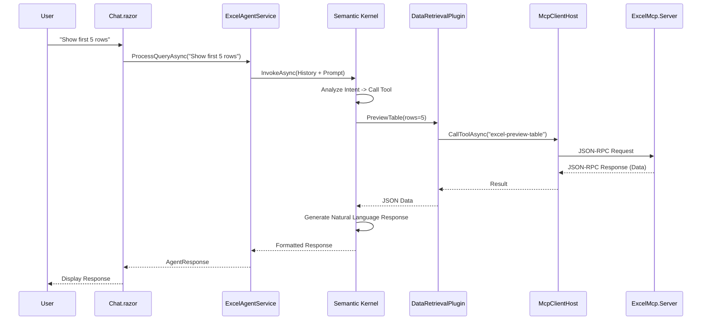

# Project Architecture Blueprint

**Generated:** November 24, 2025  
**Project:** Local Excel Conversational Agent (local-workbook-mcp)  
**Framework:** .NET 9.0 (C# 13)  
**Architecture:** Layered / Clean Architecture with MCP Integration

---

## 1. Architecture Detection and Analysis

This project implements a **Local-First, Agentic Architecture** built on the **Model Context Protocol (MCP)**. It decouples the data source (Excel) from the user interfaces (CLI, Web) using a standardized protocol, enabling modularity and extensibility.

### Technology Stack
- **Core Framework**: .NET 9.0 (C# 13)
- **Web Framework**: ASP.NET Core Blazor Server (Interactive Server)
- **AI Orchestration**: Microsoft Semantic Kernel
- **Excel Processing**: ClosedXML (OpenXML SDK wrapper)
- **CLI Interface**: Spectre.Console
- **Communication**: JSON-RPC over Standard Input/Output (Stdio) via MCP
- **Logging**: Serilog (Structured Logging)

### Architectural Pattern
The system follows a **Hexagonal / Ports and Adapters** style architecture, adapted for MCP:
- **Core Domain**: Excel data processing logic (`ExcelMcp.Server`).
- **Ports**: MCP Protocol (Stdio transport).
- **Adapters**: 
  - `ExcelMcp.Client` (CLI Adapter)
  - `ExcelMcp.ChatWeb` (Web Adapter)
  - `ExcelMcp.SkAgent` (AI Agent Adapter)

---

## 2. Architectural Overview

The **Local Excel Conversational Agent** is designed to enable natural language interaction with local Excel workbooks without uploading data to the cloud.

### Guiding Principles
1.  **Privacy First**: Data never leaves the local machine. The LLM is local (or accessed via a local proxy), and the Excel processing happens in a local process.
2.  **Decoupling via MCP**: The Excel logic is encapsulated in a standalone server (`ExcelMcp.Server`). Consumers (Web, CLI) interact with it *only* via the MCP protocol, ensuring a strict boundary.
3.  **Stateless Core, Stateful Session**: The MCP server is relatively stateless regarding conversation context. The `ChatWeb` application maintains the conversation state (`WorkbookSession`).
4.  **Plugin-Based AI**: AI capabilities are implemented as Semantic Kernel plugins that wrap MCP tool calls, allowing the LLM to "use" the Excel server as a tool.

### Boundaries
-   **Process Boundary**: The `ExcelMcp.Server` runs as a separate process from the `ChatWeb` or `SkAgent`.
-   **Protocol Boundary**: Communication crosses the process boundary via JSON-RPC (MCP).
-   **Service Boundary**: Inside `ChatWeb`, the `ExcelAgentService` orchestrates the interaction between the UI, the Semantic Kernel, and the MCP Client.

---

## 3. Architecture Visualization

### High-Level System Overview

```mermaid
graph TD
    User[User] -->|Interacts| UI[Web Chat / CLI Agent]
    
    subgraph "Host Process (ChatWeb / SkAgent)"
        UI -->|Commands| AgentService[ExcelAgentService]
        AgentService -->|Orchestrates| SK[Semantic Kernel]
        SK -->|Invokes| Plugins[SK Plugins]
        Plugins -->|Calls| McpClient[MCP Client Host]
    end
    
    McpClient <-->|JSON-RPC (Stdio)| McpServerProcess
    
    subgraph "ExcelMcp.Server Process"
        McpServerProcess[McpServer] -->|Uses| ExcelService[ExcelWorkbookService]
        ExcelService -->|Reads| ClosedXML[ClosedXML]
    end
    
    ClosedXML -->|Accesses| FileSystem[(Excel Workbook .xlsx)]
```

### Component Interaction (ChatWeb)



---

## 4. Core Architectural Components

### 1. ExcelMcp.Server
-   **Purpose**: The "Backend for Frontend" of the Excel domain. It exposes workbook structure and data as MCP resources and tools.
-   **Internal Structure**:
    -   `Program.cs`: Entry point, parses args, starts server.
    -   `McpServer`: Handles the MCP protocol loop.
    -   `ExcelWorkbookService`: Wraps ClosedXML to provide high-level data access.
-   **Interaction**: Listens on Stdio. No direct dependencies on UI or AI.

### 2. ExcelMcp.ChatWeb
-   **Purpose**: The primary user-facing application.
-   **Internal Structure**:
    -   **Components**: Blazor UI (`Chat.razor`, `WorkbookSelector.razor`).
    -   **Services**: `ExcelAgentService` (Orchestrator), `ConversationManager` (State), `ResponseFormatter`.
    -   **Plugins**: `WorkbookStructurePlugin`, `DataRetrievalPlugin` (SK integration).
-   **Interaction**: Hosts the `McpClientHost` which spawns the Server process.

### 3. ExcelMcp.Contracts
-   **Purpose**: Shared Data Transfer Objects (DTOs) to ensure type safety across the MCP boundary.
-   **Internal Structure**: Records like `ExcelSearchArguments`, `ExcelSearchResult`, `WorkbookMetadata`.
-   **Interaction**: Referenced by Server, Client, and Web.

---

## 5. Architectural Layers and Dependencies

The solution uses a **Strict Layered Architecture** enforced by project references:

1.  **Domain Layer (Implicit)**: `ExcelMcp.Contracts` defines the domain language (Workbooks, Sheets, Tables).
2.  **Infrastructure Layer**: `ExcelMcp.Server` implements the data access logic.
3.  **Application Layer**: `ExcelMcp.ChatWeb` and `ExcelMcp.SkAgent` contain the application logic and AI orchestration.
4.  **Presentation Layer**: Blazor Components (Web) and Spectre.Console (CLI).

**Dependency Flow**:
`Presentation` -> `Application` -> `Infrastructure (via MCP)` -> `Domain (Contracts)`

---

## 6. Data Architecture

### Domain Model
-   **WorkbookContext**: Represents a loaded file. Contains metadata (sheets, tables).
-   **WorkbookSession**: Represents a user's session. Holds `ConversationHistory` and `WorkbookContext`.
-   **ConversationTurn**: A single exchange (User Query + Agent Response).

### Data Access
-   **Read-Only (Current)**: The system primarily reads from Excel.
-   **On-Demand**: Data is not ingested into a database. It is queried in real-time from the `.xlsx` file via ClosedXML.
-   **Caching**: `WorkbookMetadata` is cached in `WorkbookContext` to avoid repeated structure queries.

---

## 7. Cross-Cutting Concerns Implementation

### Logging & Monitoring
-   **Pattern**: Structured Logging via **Serilog**.
-   **Implementation**: `AgentLogger` wrapper class provides semantic logging methods (`LogQuery`, `LogToolInvocation`).
-   **Correlation**: `CorrelationIdMiddleware` ensures all logs for a single request/interaction share a `CorrelationId`.

### Error Handling
-   **Pattern**: Global Exception Handling + Sanitization.
-   **Implementation**: `SanitizedError` model hides stack traces and internal paths from the user. `IResponseFormatter.SanitizeErrorMessage` maps exceptions to user-friendly messages.

### Configuration
-   **Pattern**: .NET Options Pattern (`IOptions<T>`).
-   **Sources**: `appsettings.json`, Environment Variables (`EXCEL_MCP_SERVER`), CLI Arguments.

---

## 8. Service Communication Patterns

### MCP (Model Context Protocol)
-   **Transport**: Stdio (Standard Input/Output).
-   **Format**: JSON-RPC 2.0.
-   **Pattern**: Request/Response. The Client sends a tool call request; the Server executes and returns the result.

### Internal Services
-   **Pattern**: Dependency Injection (Microsoft.Extensions.DependencyInjection).
-   **Lifetimes**:
    -   `Singleton`: `McpClientHost` (Process manager), `Plugins`.
    -   `Scoped`: `ExcelAgentService`, `WorkbookSession` (Per Blazor Circuit).

---

## 9. .NET Architectural Patterns

### Host and Application Model
-   **Web**: `WebApplication.CreateBuilder` (Minimal Hosting Model).
-   **Blazor**: Interactive Server render mode (`AddInteractiveServerComponents`).

### Semantic Kernel Integration
-   **Pattern**: Plugin-based Architecture.
-   **Implementation**:
    -   Plugins are defined as C# classes with `[KernelFunction]` attributes.
    -   Plugins are registered with the Kernel via `kernelBuilder.Plugins.AddFromObject()`.
    -   Automatic Function Calling (`ToolCallBehavior.AutoInvokeKernelFunctions`) allows the LLM to select tools.

---

## 10. Implementation Patterns

### Plugin Pattern (Semantic Kernel)
Wraps MCP calls into a format the LLM understands.

```csharp
public class DataRetrievalPlugin
{
    [KernelFunction("preview_table")]
    [Description("Get actual data rows...")]
    public async Task<string> PreviewTable(...) {
        // 1. Validate inputs
        // 2. Construct MCP arguments
        // 3. Call MCP Client
        // 4. Return JSON result
    }
}
```

### Orchestrator Pattern (ExcelAgentService)
Manages the flow of a conversation turn.

1.  **Receive Query**: `ProcessQueryAsync(query)`
2.  **Contextualize**: Build `ChatHistory` with System Prompt + Workbook Metadata + Recent History.
3.  **Invoke AI**: Call `IChatCompletionService.GetChatMessageContentAsync`.
4.  **Format**: Convert AI response (Markdown/JSON) into UI-ready format (`AgentResponse`).
5.  **Update State**: Save turn to `ConversationManager`.

---

## 11. Testing Architecture

-   **Unit Tests**: `tests/ExcelMcp.ChatWeb.Tests`
    -   Focus on `ExcelAgentService` logic, `ResponseFormatter`, and `ConversationManager`.
    -   Mocking: `Moq` used to mock `IMcpClient` and `Kernel`.
-   **Integration Tests**: Manual validation via `scripts/check-prerequisites.ps1` and sample workbooks.

---

## 12. Deployment Architecture

-   **Topology**: Single-machine deployment.
-   **Packaging**: Self-contained executables.
    -   `ExcelMcp.Server` is packaged alongside the client apps.
    -   Scripts (`package-chatweb.ps1`) handle the bundling of the .NET runtime and the server executable.
-   **Runtime**: No external dependencies (like Python or Node) required for the end user.

---

## 13. Extension and Evolution Patterns

### Adding New Features
1.  **New Excel Capability**:
    -   Add method to `ExcelWorkbookService` (Server).
    -   Expose as Tool in `McpServer` (Server).
    -   Update `ExcelMcp.Contracts` if DTOs change.
2.  **Expose to AI**:
    -   Add method to a Plugin (e.g., `DataRetrievalPlugin`) in `ChatWeb`.
    -   Decorate with `[KernelFunction]` and `[Description]`.
3.  **UI Support**:
    -   Update `Chat.razor` if specific UI handling is needed (e.g., new button).

---

## 14. Architectural Decision Records (ADR) Summary

### ADR-001: Use of Model Context Protocol (MCP)
-   **Context**: Need to separate Excel processing (heavy, potentially unstable) from the UI/Agent.
-   **Decision**: Use MCP over Stdio.
-   **Consequence**: Strong decoupling. Allows the server to be swapped or updated independently. Adds complexity of process management.

### ADR-002: Semantic Kernel for AI Orchestration
-   **Context**: Need a robust way to manage prompts, context, and tool calling.
-   **Decision**: Use Microsoft Semantic Kernel.
-   **Consequence**: Simplifies integration with OpenAI/Local LLMs. Provides a standard Plugin model.

### ADR-003: Blazor Server for Web UI
-   **Context**: Need a rich, stateful UI that interacts closely with local system resources (MCP process).
-   **Decision**: Use Blazor Server.
-   **Consequence**: Simplifies state management (C# on both ends). Requires a persistent connection (SignalR), which is acceptable for a local tool.

---

## 15. Architecture Governance

-   **Code Style**: Enforced via standard .NET conventions.
-   **Documentation**: `docs/` folder contains architectural and user guides.
-   **Validation**: `scripts/check-prerequisites.ps1` acts as a health check for the architectural components.

---

## 16. Blueprint for New Development

### Workflow for Adding a New Tool
1.  **Define Contract**: Add Request/Response records to `ExcelMcp.Contracts`.
2.  **Implement Logic**: Add logic to `ExcelWorkbookService` in `ExcelMcp.Server`.
3.  **Register Tool**: Add tool definition to `McpServer` in `ExcelMcp.Server`.
4.  **Create Plugin**: Add wrapper method to `src/ExcelMcp.ChatWeb/Services/Plugins/`.
5.  **Test**: Verify with `ExcelMcp.Client` (CLI) first, then test in Web Chat.

### Common Pitfalls
-   **Blocking the UI**: Ensure all MCP calls are async/await.
-   **Context Overflow**: Monitor `ConversationOptions.MaxContextTurns`. The LLM context window is finite.
-   **PII Leakage**: Never log the raw content of user queries or Excel data in `AgentLogger`. Use `LogQuery` which logs metadata only.
