# Project Architecture Blueprint

**Generated:** November 27, 2025  
**Project:** Local Excel Conversational Agent (local-workbook-mcp)  
**Framework:** .NET 9.0 (C# 13)  
**Architecture:** Hexagonal / Ports and Adapters with MCP Integration

---

## 1. Architecture Detection and Analysis

### Technology Stack
| Layer | Technology | Purpose |
|-------|------------|---------|
| **Runtime** | .NET 9.0 (C# 13) | Core framework, modern language features |
| **Web Framework** | ASP.NET Core Blazor Server | Interactive server-side rendering |
| **AI Orchestration** | Microsoft Semantic Kernel | LLM plugin system, chat completion |
| **Excel Processing** | ClosedXML | OpenXML SDK wrapper for .xlsx files |
| **CLI Interface** | Spectre.Console | Rich terminal UI |
| **Communication** | JSON-RPC 2.0 over Stdio | MCP protocol implementation |
| **Logging** | Serilog | Structured logging with correlation |

### Architectural Pattern
The system implements **Hexagonal Architecture (Ports and Adapters)** adapted for the Model Context Protocol:

```
┌─────────────────────────────────────────────────────────────────┐
│                        ADAPTERS (Driving)                        │
│  ┌──────────────┐  ┌──────────────┐  ┌──────────────┐           │
│  │  ChatWeb UI  │  │  CLI Agent   │  │  SkAgent     │           │
│  │  (Blazor)    │  │  (Spectre)   │  │  (Console)   │           │
│  └──────┬───────┘  └──────┬───────┘  └──────┬───────┘           │
└─────────┼─────────────────┼─────────────────┼───────────────────┘
          │                 │                 │
          ▼                 ▼                 ▼
┌─────────────────────────────────────────────────────────────────┐
│                      PORT: MCP Protocol                          │
│                 (JSON-RPC over Stdio Transport)                  │
└─────────────────────────────────────────────────────────────────┘
                              │
                              ▼
┌─────────────────────────────────────────────────────────────────┐
│                     CORE DOMAIN                                  │
│  ┌──────────────────────────────────────────────────────────┐   │
│  │              ExcelMcp.Server (MCP Server)                 │   │
│  │  ┌────────────────┐  ┌─────────────────────────────────┐ │   │
│  │  │   McpServer    │  │   ExcelWorkbookService          │ │   │
│  │  │  (Protocol)    │──│   (Domain Logic)                │ │   │
│  │  └────────────────┘  └─────────────────────────────────┘ │   │
│  └──────────────────────────────────────────────────────────┘   │
└─────────────────────────────────────────────────────────────────┘
                              │
                              ▼
┌─────────────────────────────────────────────────────────────────┐
│                   ADAPTER (Driven)                               │
│              ┌─────────────────────────┐                        │
│              │      ClosedXML          │                        │
│              │   (Excel File Access)   │                        │
│              └─────────────────────────┘                        │
└─────────────────────────────────────────────────────────────────┘
                              │
                              ▼
                    ┌───────────────┐
                    │  .xlsx Files  │
                    └───────────────┘
```

---

## 2. Architectural Overview

### Guiding Principles

1. **Privacy First**: Data never leaves the local machine. Excel processing and LLM inference both happen locally.

2. **Process Isolation**: The MCP server runs as a separate process, isolating Excel operations from the UI/AI layer. This provides:
   - Fault isolation (Excel errors don't crash the UI)
   - Resource isolation (memory/CPU separation)
   - Independent restartability

3. **Protocol-Based Decoupling**: All communication uses the Model Context Protocol (MCP), ensuring:
   - Clear contract boundaries via `ExcelMcp.Contracts`
   - Substitutable server implementations
   - Testable integrations via mocked MCP clients

4. **Plugin-Based AI**: Semantic Kernel plugins wrap MCP tool calls, allowing the LLM to autonomously select and invoke Excel operations.

### Architectural Boundaries

| Boundary | Enforcement Mechanism | Communication |
|----------|----------------------|---------------|
| **Process** | Separate OS process for Server | Stdio streams |
| **Protocol** | JSON-RPC 2.0 message format | MCP specification |
| **Service** | Interface segregation (`IMcpClient`) | Dependency injection |
| **Session** | Blazor circuit scoping | `WorkbookSession` per user |

---

## 3. Architecture Visualization

### High-Level System Overview

```mermaid
graph TD
    User[👤 User] -->|Interacts| UI[Web Chat / CLI]
    
    subgraph "Host Process"
        UI -->|Commands| Agent[ExcelAgentService]
        Agent -->|Orchestrates| SK[Semantic Kernel]
        SK -->|Auto-invokes| Plugins[SK Plugins]
        Plugins -->|Calls| MCP[McpClientHost]
    end
    
    MCP <-->|"JSON-RPC (Stdio)"| Server
    
    subgraph "ExcelMcp.Server Process"
        Server[McpServer] -->|Uses| Excel[ExcelWorkbookService]
        Excel -->|Reads| XL[ClosedXML]
    end
    
    XL -->|File I/O| FS[(📊 Excel .xlsx)]
```



### Request Flow Sequence


---

## 4. Core Architectural Components

### ExcelMcp.Server

**Purpose**: Standalone MCP server exposing Excel workbook operations as tools and resources.

**Internal Structure**:
```
ExcelMcp.Server/
├── Program.cs              # Entry point, CLI argument handling
├── Excel/
│   └── ExcelWorkbookService.cs  # Domain logic (ClosedXML wrapper)
└── Mcp/
    ├── McpServer.cs        # JSON-RPC message loop
    ├── JsonRpcTransport.cs # Stdio transport layer
    └── JsonOptions.cs      # Serialization configuration
```

**Exposed Tools**:
| Tool Name | Purpose |
|-----------|---------|
| `excel-list-structure` | Get workbook metadata (sheets, tables, columns) |
| `excel-search` | Full-text search across cells |
| `excel-preview-table` | Get data rows from a worksheet/table |
| `excel-analyze-pivot` | Analyze pivot table structure and data |

**Interaction Pattern**: Stateless request/response over Stdio. Each tool call is independent.

---

### ExcelMcp.ChatWeb

**Purpose**: Primary user-facing Blazor Server application with AI-powered chat interface.

**Internal Structure**:
```
ExcelMcp.ChatWeb/
├── Program.cs              # Host configuration, DI setup
├── Components/
│   ├── Pages/Chat.razor    # Main chat interface
│   └── Shared/             # Reusable UI components
├── Services/
│   ├── Agent/
│   │   ├── ExcelAgentService.cs    # Orchestrator
│   │   ├── ConversationManager.cs  # State management
│   │   └── ResponseFormatter.cs    # Output formatting
│   ├── Plugins/
│   │   ├── DataRetrievalPlugin.cs      # preview_table, aggregations
│   │   ├── WorkbookSearchPlugin.cs     # search_workbook
│   │   └── WorkbookStructurePlugin.cs  # list_structure
│   └── McpClientHost.cs    # MCP process manager
├── Models/
│   ├── WorkbookSession.cs  # Per-circuit session state
│   └── AgentResponse.cs    # Response DTOs
└── Options/
    └── *Options.cs         # Configuration classes
```

**Key Services**:
| Service | Lifetime | Responsibility |
|---------|----------|----------------|
| `ExcelAgentService` | Scoped | Query processing, LLM orchestration |
| `ConversationManager` | Scoped | Chat history management |
| `McpClientHost` | Singleton | MCP server process lifecycle |
| `WorkbookSession` | Scoped | Per-user workbook context |

---

### ExcelMcp.Contracts

**Purpose**: Shared DTOs ensuring type safety across the MCP boundary.

**Key Records**:
```csharp
// Resource descriptors
public sealed record ExcelResourceDescriptor(Uri Uri, string Name, string? Description, string MimeType);
public sealed record ExcelResourceContent(Uri Uri, string MimeType, string Text);

// Search contracts
public sealed record ExcelSearchArguments(string Query, string? Worksheet, string? Table, bool CaseSensitive, int? Limit);
public sealed record ExcelSearchResult(IReadOnlyList<ExcelRowResult> Rows, bool HasMore);

// Pivot table contracts
public sealed record PivotTableArguments(string Worksheet, string? PivotTable, bool IncludeFilters, int MaxRows);
public sealed record PivotTableResult(IReadOnlyList<PivotTableInfo> PivotTables);

// Workbook metadata
public sealed record WorkbookMetadata(string WorkbookPath, IReadOnlyList<WorksheetMetadata> Worksheets, DateTimeOffset LoadedAt);
```

**Design Pattern**: Immutable `sealed record` types with primary constructors. Collections use `IReadOnlyList<T>` and `IReadOnlyDictionary<K,V>`.

---

### ExcelMcp.SkAgent

**Purpose**: Standalone CLI agent for direct LLM-Excel interaction (development/testing).

**Key Class**: `ExcelAgent` - simplified orchestrator that embeds Semantic Kernel with Excel plugins.

---

### ExcelMcp.Client

**Purpose**: CLI debugging tool for direct MCP server interaction.

**Commands**: `list`, `resources`, `search`, `preview`, `analyze-pivot`

---

## 5. Architectural Layers and Dependencies

### Layer Structure

```
┌─────────────────────────────────────────────────────────────┐
│ PRESENTATION LAYER                                          │
│  • Blazor Components (Chat.razor, WorkbookSelector.razor)  │
│  • Spectre.Console CLI                                      │
└─────────────────────────────────────────────────────────────┘
                              │ uses
                              ▼
┌─────────────────────────────────────────────────────────────┐
│ APPLICATION LAYER                                           │
│  • ExcelAgentService (orchestration)                       │
│  • ConversationManager (state)                             │
│  • SK Plugins (AI integration)                             │
└─────────────────────────────────────────────────────────────┘
                              │ calls via MCP
                              ▼
┌─────────────────────────────────────────────────────────────┐
│ INFRASTRUCTURE LAYER                                        │
│  • McpServer (protocol handling)                           │
│  • ExcelWorkbookService (data access)                      │
│  • ClosedXML (file I/O)                                    │
└─────────────────────────────────────────────────────────────┘
                              │ references
                              ▼
┌─────────────────────────────────────────────────────────────┐
│ DOMAIN LAYER                                                │
│  • ExcelMcp.Contracts (DTOs, interfaces)                   │
└─────────────────────────────────────────────────────────────┘
```

### Dependency Rules

1. **Contracts** has no dependencies (leaf node)
2. **Server** references only Contracts
3. **ChatWeb** references Contracts and Client (for MCP types)
4. **Client** references Contracts
5. No circular dependencies exist

---

## 6. Data Architecture

### Domain Model


### Data Access Pattern

- **Read-Only**: System currently only reads from Excel files
- **On-Demand**: No data ingestion; queries execute directly against `.xlsx` files
- **Caching**: `WorkbookMetadata` cached in `WorkbookContext` to avoid repeated structure scans

---

## 7. Cross-Cutting Concerns Implementation

### Logging & Observability

**Implementation**: Serilog with structured logging

```csharp
// Configuration (appsettings.json)
"Serilog": {
    "MinimumLevel": { "Default": "Information" },
    "WriteTo": [
        { "Name": "Console" },
        { "Name": "File", "Args": { "path": "logs/agent-.log" } }
    ]
}

// Usage via AgentLogger wrapper
_logger.LogQuery(correlationId, "Loading workbook: {FilePath}", filePath);
_logger.LogToolInvocation(correlationId, "excel-preview-table", arguments);
```

**Correlation**: `CorrelationIdMiddleware` adds request tracking via HTTP headers.

### Error Handling

**Pattern**: Sanitized user-facing errors, detailed internal logging

```csharp
// Internal exception
catch (Exception ex)
{
    _logger.LogError(ex, "MCP tool call failed");
    return CreateErrorResponse("MCP_ERROR", _responseFormatter.SanitizeErrorMessage(ex));
}

// User-facing response
public string SanitizeErrorMessage(Exception ex) => ex switch
{
    FileNotFoundException => "Workbook file not found",
    TimeoutException => "Operation timed out",
    _ => "An unexpected error occurred"
};
```

### Configuration

**Pattern**: .NET Options pattern with validation

```csharp
// Registration
builder.Services.AddOptions<SemanticKernelOptions>()
    .Bind(builder.Configuration.GetSection("SemanticKernel"))
    .ValidateDataAnnotations()
    .ValidateOnStart();

// Options class
public class SemanticKernelOptions
{
    [Required] public string BaseUrl { get; set; } = "http://localhost:1234/v1";
    [Required] public string Model { get; set; } = "local-model";
    public int TimeoutSeconds { get; set; } = 480;
}
```

---

## 8. Service Communication Patterns

### MCP Protocol

| Aspect | Implementation |
|--------|----------------|
| **Transport** | Standard Input/Output (Stdio) |
| **Format** | JSON-RPC 2.0 |
| **Pattern** | Request/Response (synchronous) |
| **Process Model** | Client spawns Server as child process |

**Message Flow**:
```
Client                              Server
  │                                   │
  │ ──── initialize ────────────────► │
  │ ◄─── result (capabilities) ────── │
  │                                   │
  │ ──── tools/call ────────────────► │
  │ ◄─── result (data) ────────────── │
  │                                   │
  │ ──── shutdown ──────────────────► │
  │ ◄─── result (ack) ────────────── │
```

### Dependency Injection

| Service | Lifetime | Rationale |
|---------|----------|-----------|
| `McpClientHost` | Singleton | Manages single server process |
| `Kernel` | Singleton | Thread-safe, expensive to create |
| `ExcelAgentService` | Scoped | Per-circuit conversation state |
| `WorkbookSession` | Scoped | Per-user workbook context |

---

## 9. .NET-Specific Patterns

### Semantic Kernel Integration

**Plugin Definition**:
```csharp
public class DataRetrievalPlugin
{
    private readonly IMcpClient _mcpClient;

    [KernelFunction("preview_table")]
    [Description("Get data rows from a worksheet. Use when user wants to SEE THE DATA.")]
    public async Task<string> PreviewTable(
        [Description("Worksheet name")] string worksheet,
        [Description("Max rows (1-100)")] int rows = 10)
    {
        var args = new JsonObject { ["worksheet"] = worksheet, ["rows"] = rows };
        var result = await _mcpClient.CallToolAsync("excel-preview-table", args, CancellationToken.None);
        return result.Content?.ToString() ?? "No data";
    }
}
```

**Registration**:
```csharp
kernelBuilder.Plugins.AddFromObject(new DataRetrievalPlugin(mcpClient));
```

**Invocation**: Automatic via `ToolCallBehavior.AutoInvokeKernelFunctions`

### Blazor Server State Management

- **Circuit Scope**: `WorkbookSession` is scoped to Blazor circuit (per browser tab)
- **State Preservation**: `ConversationManager` maintains chat history across requests
- **Disposal**: `IAsyncDisposable` on `McpClientHost` ensures clean process termination

---

## 10. Implementation Patterns

### Orchestrator Pattern (ExcelAgentService)

```csharp
public async Task<AgentResponse> ProcessQueryAsync(string query, WorkbookSession session, CancellationToken ct)
{
    // 1. Build context
    var history = _conversationManager.BuildHistory(session, query);
    
    // 2. Invoke LLM with tool calling
    var response = await _chatService.GetChatMessageContentAsync(
        history,
        new OpenAIPromptExecutionSettings { ToolCallBehavior = ToolCallBehavior.AutoInvokeKernelFunctions },
        _kernel, ct);
    
    // 3. Format and return
    return _responseFormatter.Format(response);
}
```

### Plugin Wrapper Pattern

Each SK plugin wraps an MCP tool call with:
1. Input validation
2. Argument construction
3. MCP invocation
4. Error handling and response formatting

---

## 11. Testing Architecture

### Test Projects

| Project | Purpose | Frameworks |
|---------|---------|------------|
| `ExcelMcp.ChatWeb.Tests` | Agent service logic | xUnit, Moq |
| `ExcelMcp.Server.Tests` | Workbook service logic | xUnit |
| `ExcelMcp.Contracts.Tests` | DTO serialization | xUnit |

### Testing Strategy

- **Unit Tests**: Mock `IMcpClient` to test `ExcelAgentService` in isolation
- **Integration Tests**: Use sample workbooks in `test-data/` with real MCP server
- **Manual Validation**: `scripts/check-prerequisites.ps1` for environment health checks

---

## 12. Deployment Architecture

### Topology
Single-machine deployment with self-contained executables.

### Packaging
```powershell
# Package ChatWeb with embedded Server
./scripts/package-chatweb.ps1

# Output structure:
publish/
├── ExcelMcp.ChatWeb.exe      # Main application
├── ExcelMcp.Server.exe       # Bundled MCP server
└── wwwroot/                  # Static assets
```

### Runtime Requirements
- .NET 9.0 Runtime (self-contained option available)
- Local LLM (LM Studio, Ollama) on port 1234

---

## 13. Extension and Evolution Patterns

### Adding a New Excel Capability

1. **Define Contract** (`ExcelMcp.Contracts`):
   ```csharp
   public sealed record NewFeatureArguments(string Param1, int Param2);
   public sealed record NewFeatureResult(IReadOnlyList<string> Data);
   ```

2. **Implement Logic** (`ExcelMcp.Server`):
   ```csharp
   // ExcelWorkbookService.cs
   public async Task<NewFeatureResult> NewFeatureAsync(NewFeatureArguments args, CancellationToken ct)
   {
       // Implementation using ClosedXML
   }
   ```

3. **Register Tool** (`ExcelMcp.Server`):
   ```csharp
   // McpServer.cs constructor
   _tools.Add("excel-new-feature", HandleNewFeatureAsync);
   ```

4. **Create Plugin** (`ExcelMcp.ChatWeb`):
   ```csharp
   [KernelFunction("new_feature")]
   [Description("...")]
   public async Task<string> NewFeature(...)
   ```

5. **Test**: Verify with CLI first, then in Web Chat

---

## 14. Architectural Decision Records

### ADR-001: Model Context Protocol (MCP)

**Context**: Need to isolate Excel processing from UI/AI layer.

**Decision**: Use MCP with Stdio transport.

**Consequences**:
- ✅ Strong process isolation
- ✅ Standardized protocol (future interop)
- ⚠️ Added complexity of process management
- ⚠️ Startup latency for server process

### ADR-002: Semantic Kernel

**Context**: Need structured LLM integration with tool calling.

**Decision**: Use Microsoft Semantic Kernel.

**Consequences**:
- ✅ Standardized plugin model
- ✅ Automatic function calling
- ✅ OpenAI-compatible API support
- ⚠️ Learning curve for plugin development

### ADR-003: Blazor Server

**Context**: Need stateful UI with local resource access.

**Decision**: Use Blazor Server (not WebAssembly).

**Consequences**:
- ✅ C# on both client and server
- ✅ Direct access to MCP client
- ✅ No WASM payload
- ⚠️ Requires persistent SignalR connection

---

## 15. Architecture Governance

### Code Conventions

- **Namespaces**: File-scoped (`namespace ExcelMcp.Server;`)
- **DTOs**: `sealed record` with primary constructors
- **Collections**: `IReadOnlyList<T>`, `IReadOnlyDictionary<K,V>`
- **Async**: All I/O operations use `async/await`

### Validation

- `dotnet build` at solution root
- Unit tests in `tests/` folder
- Sample workbooks in `test-data/`

---

## 16. Blueprint for New Development

### Workflow for Adding Features


### Common Pitfalls

| Issue | Prevention |
|-------|------------|
| Blocking UI thread | Always use `async/await` for MCP calls |
| Context overflow | Monitor `MaxContextTurns` setting |
| PII leakage | Use `AgentLogger` methods, not raw logging |
| Stale metadata | Reload workbook context on file changes |

### Implementation Checklist

- [ ] Contract added to `ExcelMcp.Contracts`
- [ ] Service method in `ExcelWorkbookService`
- [ ] Tool registered in `McpServer._tools`
- [ ] Plugin method with `[KernelFunction]` attribute
- [ ] CLI command in `ExcelMcp.Client`
- [ ] Documentation updated
- [ ] Test coverage added

---

*Last Updated: November 27, 2025*  
*Recommendation: Review and update this blueprint when adding new components or making significant architectural changes.*
